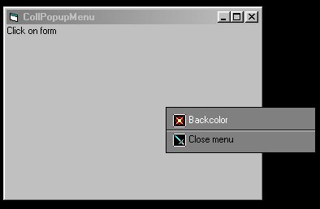



## Rolling PopupMenu \(improved\)

### Description

This application demonstrates a customized popup menu, with a "rolling" (vertically scrolled and gradually revealed) effect. It works by using a second form embedded within the first as the popup menu. For more code samples visit my personal web site: click above on my full name.
 
### More Info
 

             |
---                |---
**Submitted On**   |2001-05-27 05:06:30
**By**             |[Alexander Anikin](https://github.com/Planet-Source-Code/PSCIndex/blob/master/ByAuthor/alexander-anikin.md)
**Level**          |Intermediate
**User Rating**    |4.6 (23 globes from 5 users)
**Compatibility**  |VB 5\.0, VB 6\.0
**Category**       |[Custom Controls/ Forms/  Menus](https://github.com/Planet-Source-Code/PSCIndex/blob/master/ByCategory/custom-controls-forms-menus__1-4.md)
**World**          |[Visual Basic](https://github.com/Planet-Source-Code/PSCIndex/blob/master/ByWorld/visual-basic.md)
**Archive File**   |[Rolling Po201105262001\.zip](https://github.com/Planet-Source-Code/alexander-anikin-rolling-popupmenu-improved__1-23483/archive/master.zip)

